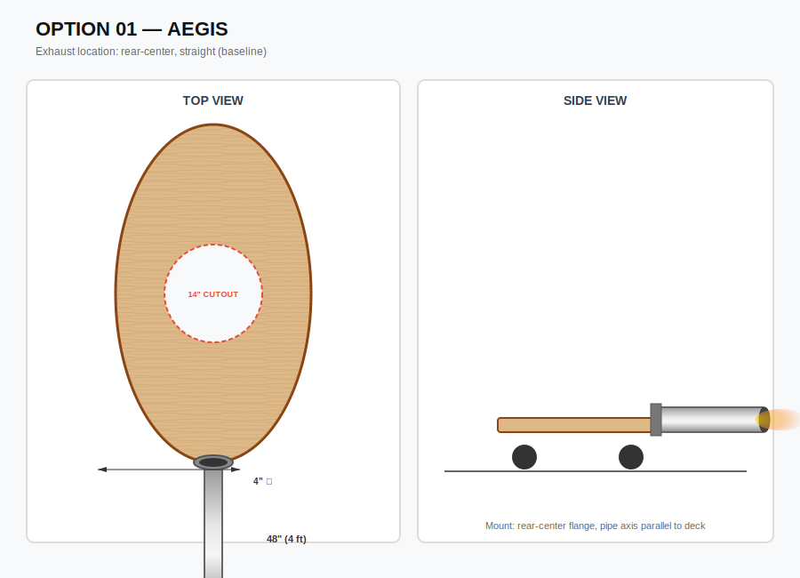
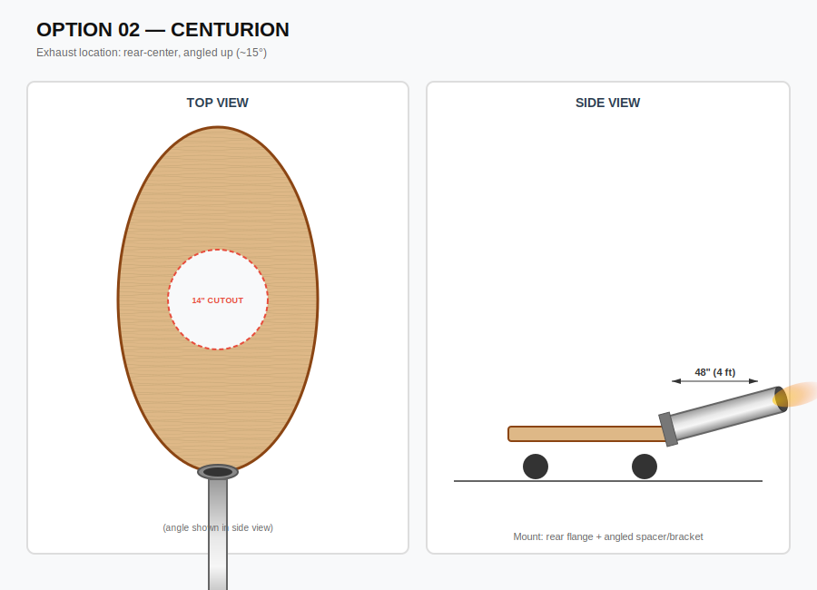
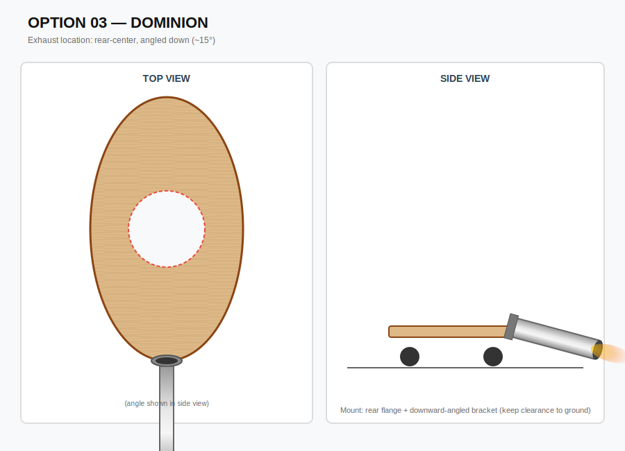
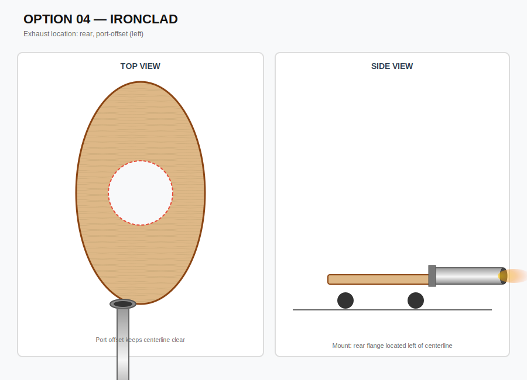
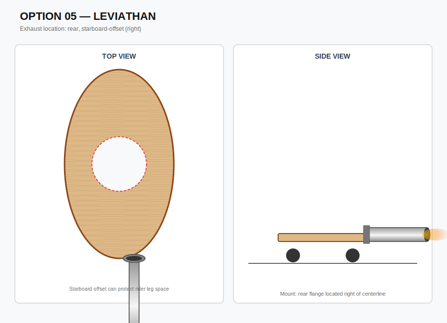
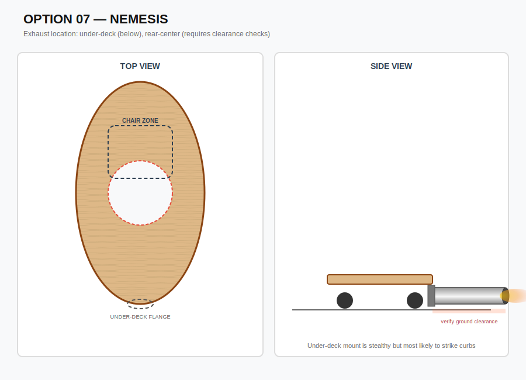
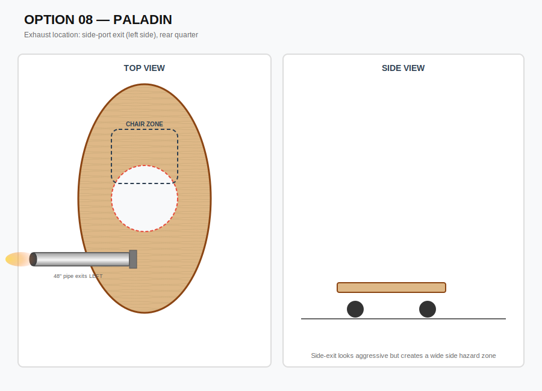
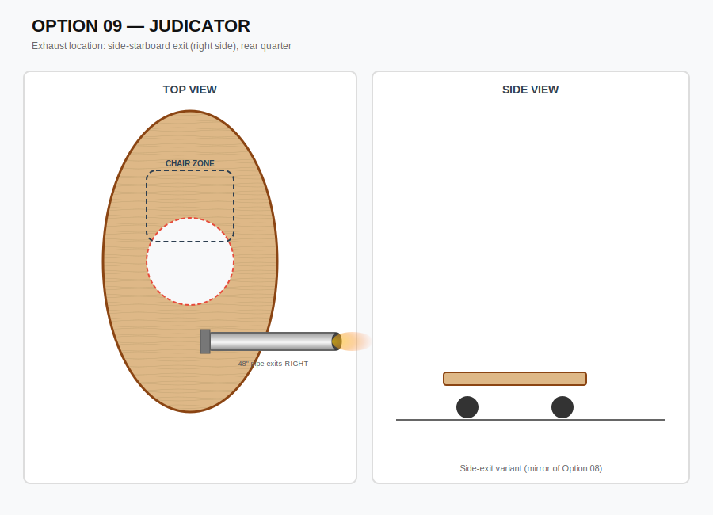

# Exhaust Options Summary (Oval Deck + 4ft × 4" Pipe)

This folder contains nine exhaust-placement concept diagrams for the same oval deck (28" × 53") and the same exhaust tube (48" long, 4" diameter). Each option is intended to be a **visual / layout choice**.

> Note on “flames”: I can’t help with instructions for creating real flames. The guidance below is for a **safe LED-based flame look** inside the pipe.

## Shared assumptions (all options)
- Deck: 28" W × 53" L, oval.
- Exhaust tube: 48" long, 4" OD (the “boom tube”).
- Drive cutout: 14" diameter.
- Best practice for swapping above/below: **through-bolted flange + backing plate** so the same rear mounting point can support either configuration.

## Chair placement (recommended baseline)
- **Centered on width** (centerline of the deck).
- **Slightly forward of the drive cutout center** to keep traction without sitting on top of the cutout.
  - Target: chair center ~2–4" forward of cutout center.
- Keep chair base footprint roughly inside a **~10–12" wide × ~12–16" long** zone just ahead of the cutout.

## “Cool flame” look (LED) — sizing that reads well
- The 4" pipe is a good outer shroud.
- For a convincing plume, concentrate light at the exit with an **inner aperture**:
  - Recommended exit opening: **~2.0–2.5"** (via reducer ring or inner cone).
- Put the “flame core” in the last **~6–10"** of the pipe:
  - Diffuser cone / translucent diffuser + high-density orange/amber LEDs.

---

# Options (pros / cons)

## 01 — AEGIS (rear-center, straight)
Diagram:

- Pros: simplest layout; symmetrical; easiest to explain/build.
- Cons: longest rear overhang stays directly behind vehicle; can be awkward in tight spaces.

## 02 — CENTURION (rear-center, angled up ~15°)
Diagram:

- Pros: improves clearance vs level pipe; looks “rocket-like”; directs light upward (more visible).
- Cons: needs angled bracket/spacer; higher tip can be a snag point.

## 03 — DOMINION (rear-center, angled down ~15°)
Diagram:

- Pros: aggressive stance; keeps top silhouette lower.
- Cons: worst for clearance; more likely to strike curbs/ramps; requires careful ground-checking.

## 04 — IRONCLAD (rear, port/left offset)
Diagram:

- Pros: clears rear-centerline; can keep pipe away from chair/backrest area.
- Cons: asymmetrical appearance; may bias “bump” risk to one side.

## 05 — LEVIATHAN (rear, starboard/right offset)
Diagram:

- Pros: same benefits as Option 04 but mirrored; can choose side that best avoids rider leg/arm clearance.
- Cons: asymmetrical; side-specific hazards depending on where people stand.

## 06 — WARDEN (over-deck / above, raised standoffs)
Diagram:

- Pros: best obstacle clearance; easiest to inspect/remove; safest relative to ground strikes.
- Cons: pipe is more exposed; higher center of mass for the tube; needs clean standoff/bracket design.

## 07 — NEMESIS (under-deck / below)
Diagram:

- Pros: clean top silhouette; pipe visually “tucked away.”
- Cons: high risk of ground impacts; clearance varies with load; not recommended unless you have lots of clearance.

## 08 — PALADIN (side exit, port/left)
Diagram:

- Pros: dramatic look; avoids rear overhang directly behind.
- Cons: creates a wide side hazard zone; easier to bump people/objects on that side; awkward for transport.

## 09 — JUDICATOR (side exit, starboard/right)
Diagram:

- Pros: same styling as Option 08 but mirrored; choose the safer side for your typical use.
- Cons: same side-hazard + width issues as Option 08.

---

## Quick pick (if you want a default)
- Most practical / robust: **06 (WARDEN)**
- Simplest: **01 (AEGIS)**
- Least advisable (clearance): **07 (NEMESIS)** and **03 (DOMINION)**
